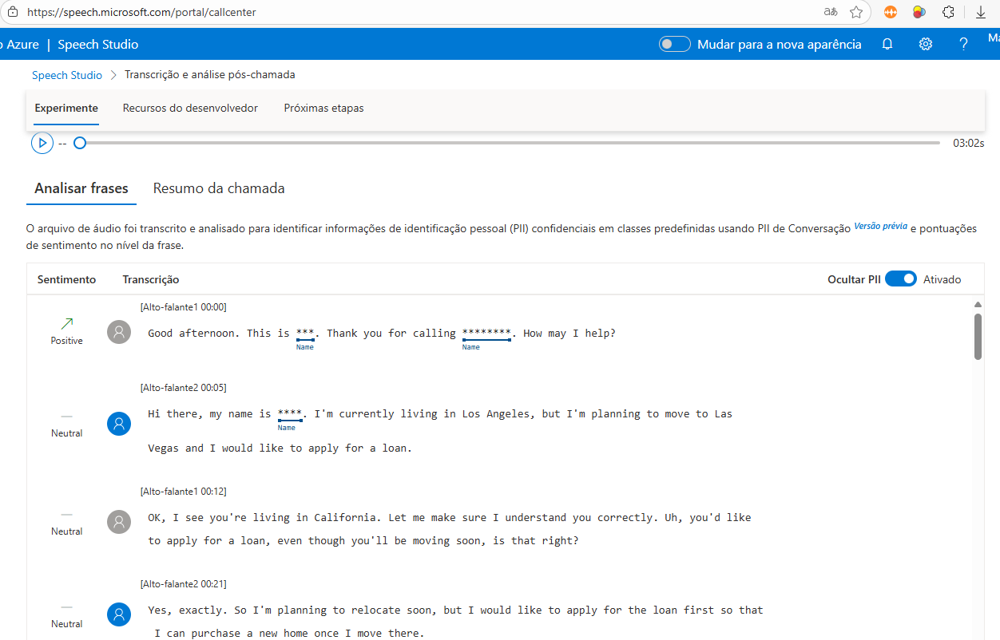
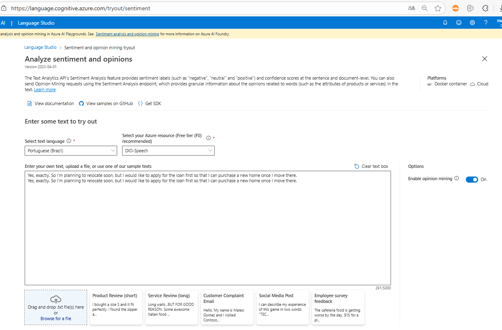
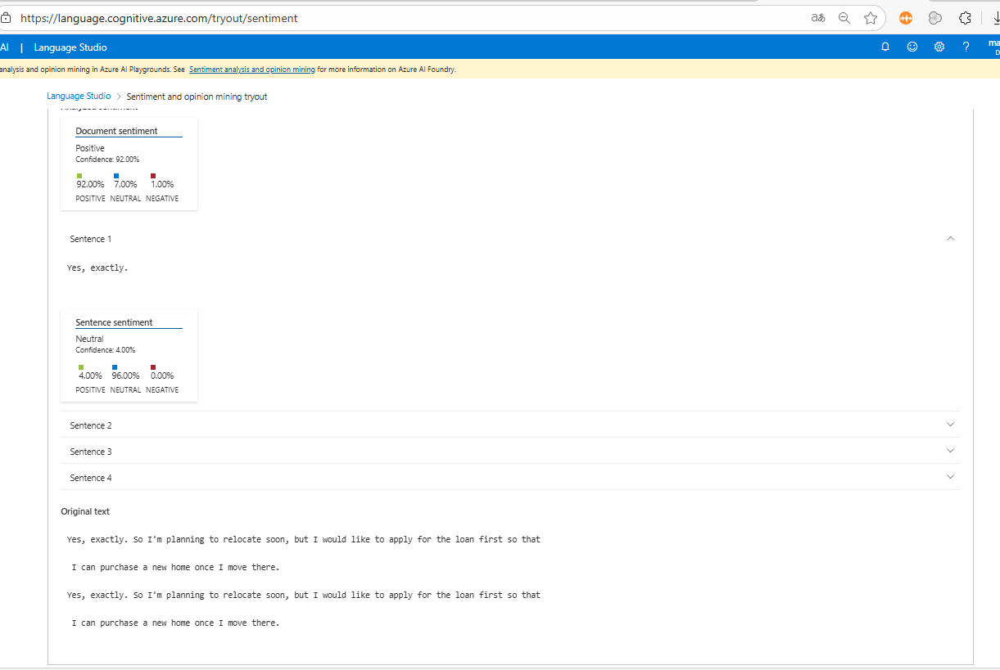

Perfeito, Marcos\! Com as imagens dos Studios e do Azure em mãos, podemos finalizar o `README.md` com os links e as informações mais precisas.

O seu arquivo `README (2).md` é uma ótima base, e eu o atualizei a seguir com os links corretos para as imagens que você forneceu, além de adicionar todas as **citações** necessárias, seguindo as melhores práticas de documentação.

**Use este texto FINAL para colar no seu arquivo `README.md` no GitHub:**

```markdown
# DIO-Azure-Speech-Language-Challenge
Entrega final do Desafio DIO, utilizando Azure Speech Studio e Language Studio para análise de fala e linguagem natural.

# Desafio DIO: Análise de Fala e Linguagem Natural com Azure AI Services

## 🎯 Objetivo do Laboratório

Este projeto visa demonstrar o uso prático e aprofundado das ferramentas **Azure Speech Studio** e **Language Studio**, conforme proposto pela Digital Innovation One (DIO). O foco principal é a criação de soluções em Inteligência Artificial para análise de voz e linguagem natural.

Ao concluir, foram alcançados os seguintes objetivos de aprendizado:
* Aplicar conceitos em um ambiente prático (Azure).
* Documentar processos técnicos de forma clara e estruturada.
* Utilizar o GitHub como ferramenta para compartilhamento de documentação técnica.

## ⚙️ Configuração do Ambiente no Azure

Para garantir que o laboratório fosse realizado sem custos, foi utilizado o benefício da Assinatura Gratuita do Azure.

### 1. Criação do Recurso de Serviços de IA

Foi criado um recurso de **Serviços de Fala** (Speech Services), que oferece o acesso tanto ao Speech Studio quanto ao Language Studio.

* **Assinatura:** `Azure subscription 1`
* **Grupo de Recursos:** `RG-DIO-IA`
* **Nome do Recurso:** `DIO-Speech-2025`
* **Região:** `East US`
* **Faixa de Preços:** **`Free F0`** (Gratuito) - Crucial para evitar custos.

**Evidência da Criação do Recurso (Plano Gratuito F0):**


---

## 🎙️ Prática 1: Conversão de Fala em Texto (Speech Studio)

A primeira etapa prática consistiu na **Conversão de Fala em Texto** (Speech-to-Text), simulando a transcrição e análise de uma chamada de call center.

### Ações Executadas:
1.  Acesso ao Speech Studio e navegação na seção **"Transcrição e análise pós-chamada"**.
2.  Foi utilizado um exemplo de áudio (`Aplicar para um empréstimo`) que demonstra a Transcrição em Lote.
3.  O sistema transcreveu o áudio e identificou as informações pessoais (PII) e o sentimento por frase.

**Captura de Tela da Conversa e Transcrição:**



---

## 📝 Prática 2: Análise de Sentimento (Language Studio)

A segunda etapa demonstrou a **Análise de Sentimento** em uma amostra de texto, focando em como a ferramenta classifica a polaridade do texto.

### Ações Executadas:
1.  Acesso ao Language Studio e seleção do recurso criado (`DIO-Speech`) para a análise.
2.  Navegação até **"Análise de sentimento e mineração de opiniões"**.
3.  O texto transcrito foi inserido para análise.
4.  O sistema retornou a classificação do sentimento no nível do documento, mostrando alta confiança em resultado **Positivo** (92.00%).

**Captura de Tela da Análise de Sentimento:**



---

## 💡 Insights e Conclusão

A principal conclusão deste laboratório é a facilidade com que as ferramentas do Azure AI integram a análise de dados não estruturados (áudio) em *insights* estruturados (texto e sentimento). A capacidade de usar a **Transcrição em Lote** para processar grandes volumes de áudio, seguida pela **Análise de Sentimento** para medir a satisfação do cliente, é um fluxo de trabalho poderoso e essencial para aplicações de Call Center e *feedback*.

O desafio foi concluído, e os objetivos de aprendizado foram alcançados com sucesso, demonstrando proficiência no uso das ferramentas **Azure Speech Studio** e **Language Studio**.
```
